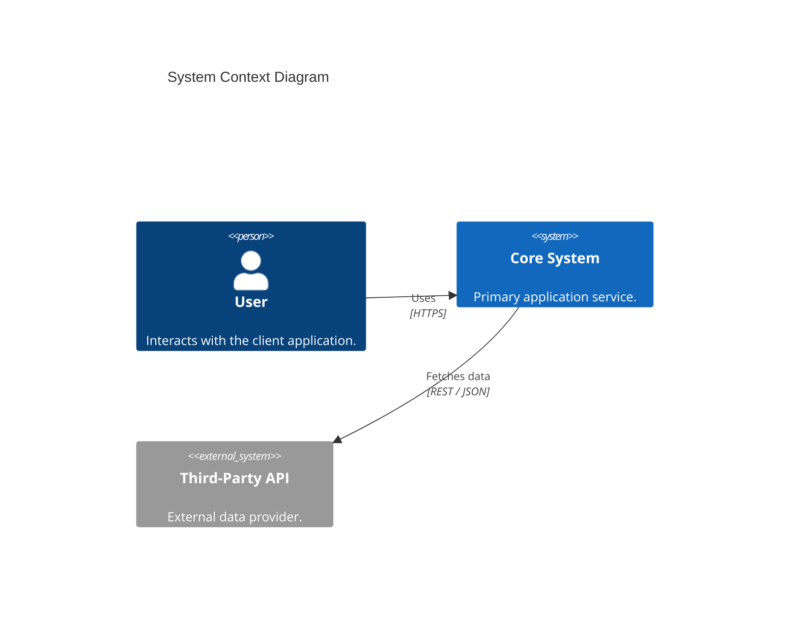
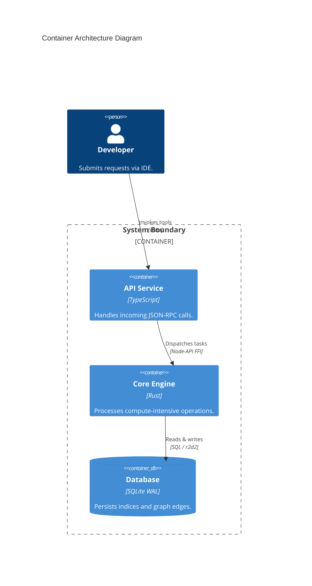

# C4 Architecture Modeling Skill

This skill defines the technical standards for visual software architecture documentation based on the **C4 Model** (Context, Containers, Components, Code) using official **Mermaid.js C4 syntax**.

---

## 1. Abstraction Levels

1. **Level 1: System Context (`C4Context`)**:
   - Focus: System scope, human users/personas, external third-party software, and high-level boundaries.
2. **Level 2: Containers (`C4Container`)**:
   - Focus: Separately deployable executable units (APIs, workers, web applications, databases, file stores).
3. **Level 3: Components (`C4Component`)**:
   - Focus: Modular groupings within a single container (controllers, repositories, services, analyzers).
   - AutoDoc dynamically derives Level 3 components directly from SQLite WAL `symbols` and `edges`, weighting high cyclomatic complexity ($CC$) modules and rendering actual internal call relationships.
4. **Level 4: Code (`C4Code` / Class Diagrams)**:
   - Focus: In-depth code relationships, interfaces, and design patterns.

---

## 2. Standard Mermaid.js C4 Syntax Rules

All architectural diagrams must use standard Mermaid C4 directives:

### System Context Example (Level 1)

### Container Diagram Example (Level 2)

---

## 3. Diagram Quality Checklist

1. **Explicit Roles & Types**: Every element must define an identifier, a descriptive label, and its role.
2. **Documented Technologies**: Container and component elements must declare their primary runtime or language.
3. **Action-Oriented Relationships**: Every `Rel()` directive must state a descriptive action verb and the transport protocol.
