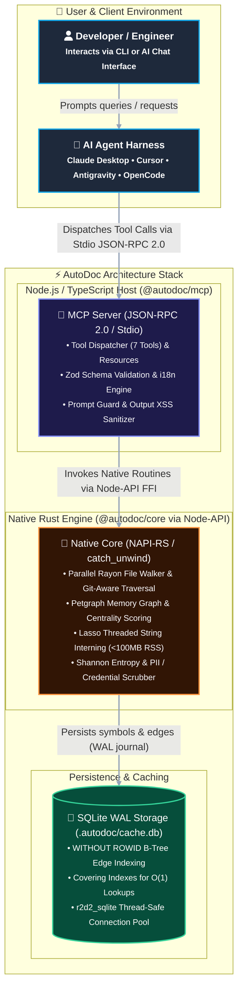

# AutoDoc Code Explorer MCP Server

[](https://github.com/dandgabr/autodoc/actions)
[](https://opensource.org/licenses/MIT)
[](https://napi.rs)
[](https://www.rust-lang.org)

**AutoDoc** is an intelligent codebase mapping and architecture documentation server built on the [Model Context Protocol (MCP)](https://modelcontextprotocol.io). It attaches directly to AI agent harnesses—including Claude Desktop, Google Antigravity, Cursor, Cline, and OpenCode—to explore repositories, trace data flows, inventory enterprise API contracts, and generate interactive C4 diagrams.

---

## Architecture at a Glance

AutoDoc pairs a high-performance **Rust Core Engine** (`crates/autodoc-core`) with a **TypeScript MCP Server** (`packages/autodoc-mcp`) via Node-API bindings:



---

## Key Capabilities

- **Memory Efficient (<100MB RSS)**: String interning via `lasso::ThreadedRodeo` and compact 20-byte POD graph nodes keep memory usage minimal, even on 1M+ LOC codebases.
- **Multi-Threaded Traversal**: Rayon threadpool with work-stealing scans files concurrently, honoring `.gitignore` rules and tracking Git object IDs.
- **30 Years of Enterprise Protocols**: Detects and catalogs contracts across CORBA (OMG IDL), SOAP (WSDL/XSD), WCF, REST (OpenAPI), gRPC (Protobuf), and GraphQL.
- **Defense-in-Depth Security**:
  - **Indirect Prompt Injection (OWASP LLM01)**: Wraps source code in `<untrusted_code_context>` tags.
  - **Output Handling (OWASP LLM05)**: Escapes HTML entities in Mermaid diagrams and neutralizes malicious URIs (`javascript:`, `data:`).
  - **Context Denial of Wallet (OWASP LLM10)**: Prunes call graphs using PageRank centrality down to 35 key nodes.
  - **Modular PII & Secret Scrubbing**: Redacts 30+ credential patterns, high-entropy tokens ($H \ge 4.5$), and extensible PII catalogs (LATAM, EU, US, FinTech, Healthcare).
- **Extensible Localization**: Ships with `en-US`, `pt-BR`, and `es-ES`, supporting dynamic registration for additional languages (`fr-FR`, `de-DE`, `ja-JP`).
- **Permissive Open-Source Licensing**: 100% MIT-licensed with zero copyleft dependencies, verified automatically by `cargo-deny` and `license-checker`.

---

## Quickstart

### Prerequisites
- Node.js v20.0.0 or higher
- Rust toolchain 1.85.0 or higher

### Build from Source
```bash
# 1. Clone repository
git clone https://github.com/dandgabr/autodoc.git
cd autodoc

# 2. Install dependencies
npm install

# 3. Build native Rust core and TypeScript server
npm run build -w @autodoc/core
npm run build -w @autodoc/mcp

# 4. Run tests
cargo test -p autodoc-core
npm test -w @autodoc/mcp
```

---

## Agent Configuration Snippets

### Claude Desktop
Add to `claude_desktop_config.json`:
```json
{
  "mcpServers": {
    "autodoc": {
      "command": "node",
      "args": ["/path/to/autodoc/packages/autodoc-mcp/dist/index.js"],
      "env": {
        "AUTODOC_LOCALE": "en-US",
        "NODE_ENV": "production"
      }
    }
  }
}
```

### OpenCode
Generate your configuration directly from the CLI:
```bash
node /path/to/autodoc/packages/autodoc-mcp/dist/index.js --print-opencode-config > opencode.json
```

Or configure `.opencode/mcp.json`:
```json
{
  "mcpServers": {
    "autodoc": {
      "command": "node",
      "args": ["/path/to/autodoc/packages/autodoc-mcp/dist/index.js"],
      "env": {
        "AUTODOC_LOCALE": "en-US",
        "NODE_ENV": "production"
      }
    }
  }
}
```

### Cursor IDE
Add to `.cursor/mcp.json`:
```json
{
  "mcpServers": {
    "autodoc": {
      "command": "node",
      "args": ["/path/to/autodoc/packages/autodoc-mcp/dist/index.js"],
      "env": {
        "AUTODOC_LOCALE": "en-US"
      }
    }
  }
}
```

---

## MCP Tools Reference

| Tool | Purpose |
| :--- | :--- |
| `autodoc_scan_repository` | Scans repository structure, polyglot languages, and LOC metrics. |
| `autodoc_get_c4_diagram` | Generates sanitized C4 Level 1 to 4 diagrams in Mermaid.js or Structurizr DSL. |
| `autodoc_get_symbol_contract` | Extracts symbol signature wrapped in semantic prompt defense boundaries. |
| `autodoc_trace_data_flow` | Traces taint data flows from entrypoint sources to storage sinks. |
| `autodoc_list_api_contracts` | Inventories service endpoints (REST, SOAP, gRPC, CORBA). |
| `autodoc_generate_adr` | Synthesizes Architectural Decision Records in MADR Markdown format. |
| `autodoc_purge_cache` | Purges and vacuums SQLite cache to comply with GDPR/LGPD. |

---

## Documentation

Comprehensive documentation adhering to the **Diátaxis Framework** is available in the [`docs/`](docs/) directory:
- **Tutorials**: [Getting Started with AutoDoc](docs/tutorials/getting-started.md)
- **How-to Guides**:
  - [Connect AutoDoc to AI Agents](docs/how-to/connect-to-agents.md)
  - [Configure and Extend PII Scrubbing](docs/how-to/configure-pii-scrubbing.md)
  - [Add Custom Locales](docs/how-to/custom-locales.md)
- **Reference**:
  - [MCP Protocol & Tool Contracts](docs/reference/mcp-contracts.md)
  - [REST API Contract & Swagger Spec](docs/reference/api/swagger.md)
  - [Internal APIs & Node-API FFI](docs/reference/internal-apis.md)
  - [Functions & Symbol Catalog](docs/reference/functions-reference.md)
  - [MCP Tools Specification](docs/reference/tools.md)
  - [System Architecture Specification](docs/reference/architecture.md)
  - [Self-Mapped Codebase Topology (C1-C4)](docs/reference/codebase-map.md)
  - [Open-Source Licensing and Compliance](docs/reference/licensing.md)
- **Explanation**:
  - [Why Rust and TypeScript?](docs/explanation/hybrid-architecture.md)
  - [Security and Defense-in-Depth Model](docs/explanation/security-model.md)

---

## License

This project is licensed under the **MIT License**. See the [LICENSE](LICENSE) file for details.
