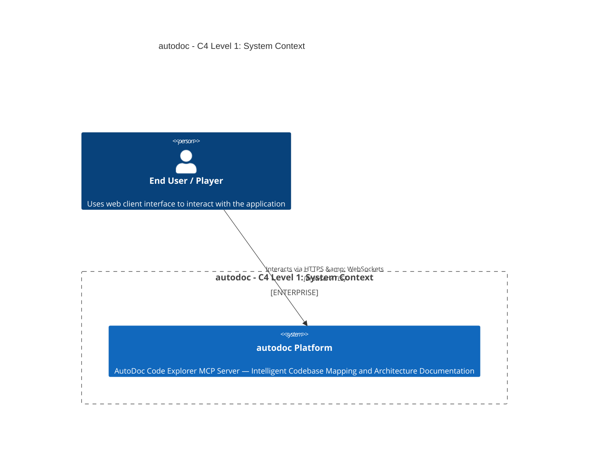
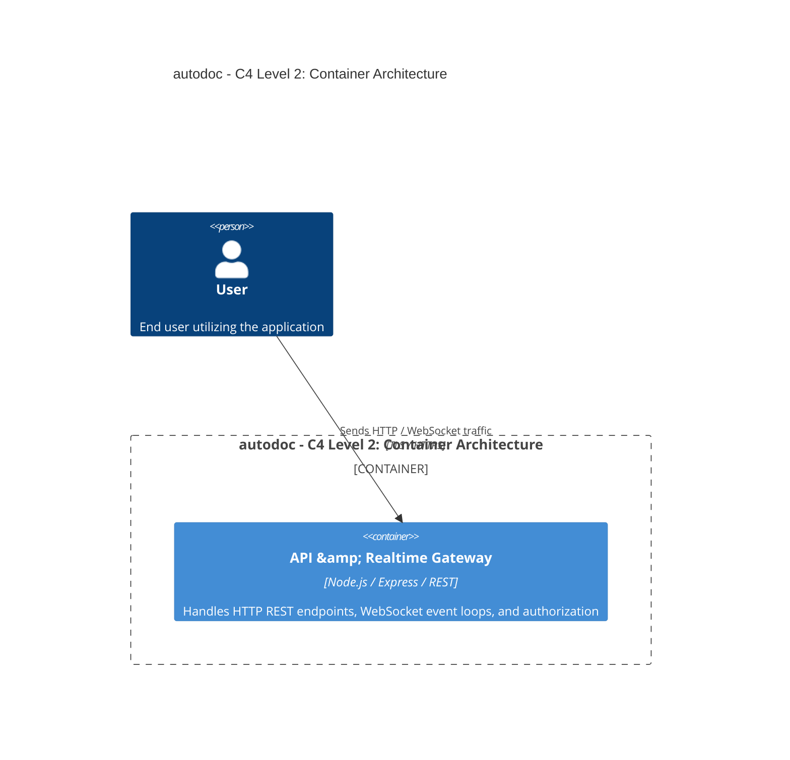

# Architecture Overview: autodoc

## 1. System Context (C4 Level 1)

## 2. Container Architecture (C4 Level 2)

## 3. Technology Stack Summary
- **Core Application**: autodoc
- **Data Persistence**: MongoDB / Relational Storage Engine
- **Communication Protocols**: HTTP REST & Real-time WebSockets / WebRTC