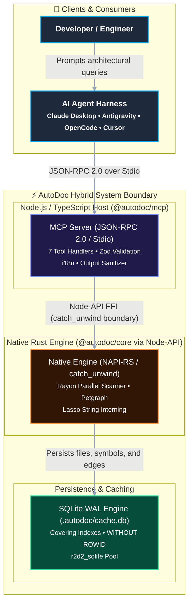

# Reference: System Architecture Specification

Low-level technical specification of the AutoDoc hybrid Rust/TypeScript stack.

---

## High-Level Topology

AutoDoc employs a two-tier architecture:
1. **TypeScript MCP Layer (`packages/autodoc-mcp`)**: Implements the Model Context Protocol JSON-RPC 2.0 lifecycle over `stdio`, schema validation via Zod, and output formatting.
2. **Rust Core Engine (`crates/autodoc-core`)**: Handles compute-intensive operations (tree traversal, string interning, graph algorithms, and SQLite storage) exposed via NAPI-RS native bindings.



---

## Memory Allocation and Footprint (<100MB RSS)

To process repositories with millions of lines of code without exhausting agent memory:
- **String Interning**: Repeated identifiers (package names, file paths, symbol signatures) are interned using `lasso::ThreadedRodeo`. Interned tokens are represented as compact `u32` keys.
- **Compact Graph Nodes**: Petgraph nodes use a plain-old-data (POD) representation sized at 20 bytes per node:
  ```rust
  #[repr(C)]
  pub struct CompactNode {
      pub file_id: u32,
      pub symbol_id: u32,
      pub kind: u8,
      pub flags: u8,
      pub start_line: u32,
      pub end_line: u32,
  }
  ```
- **Custom Global Allocator**: `mimalloc` replaces the system allocator for concurrent multithreaded allocation.

---

## Storage Engine: SQLite in WAL Mode

AutoDoc stores graph metadata in `.autodoc/cache.db`.

### Pragma Configuration
```sql
PRAGMA journal_mode = WAL;
PRAGMA synchronous = NORMAL;
PRAGMA busy_timeout = 5000;
PRAGMA temp_store = MEMORY;
PRAGMA mmap_size = 268435456; /* 256MB memory-mapped I/O */
PRAGMA cache_size = -32000;   /* 32MB page cache */
```

### Relational Schema
```sql
CREATE TABLE IF NOT EXISTS files (
    id INTEGER PRIMARY KEY AUTOINCREMENT,
    path TEXT UNIQUE NOT NULL,
    git_oid TEXT NOT NULL,
    loc INTEGER NOT NULL DEFAULT 0,
    scanned_at INTEGER NOT NULL
);

CREATE TABLE IF NOT EXISTS symbols (
    id INTEGER PRIMARY KEY AUTOINCREMENT,
    file_id INTEGER NOT NULL REFERENCES files(id) ON DELETE CASCADE,
    name TEXT NOT NULL,
    kind TEXT NOT NULL,
    signature TEXT NOT NULL,
    start_line INTEGER NOT NULL,
    end_line INTEGER NOT NULL
);

CREATE TABLE IF NOT EXISTS edges (
    source_id INTEGER NOT NULL REFERENCES symbols(id) ON DELETE CASCADE,
    target_id INTEGER NOT NULL REFERENCES symbols(id) ON DELETE CASCADE,
    kind TEXT NOT NULL,
    weight REAL NOT NULL DEFAULT 1.0,
    PRIMARY KEY (source_id, target_id, kind)
) WITHOUT ROWID;

CREATE INDEX IF NOT EXISTS idx_edges_incoming_covering 
ON edges (target_id, kind, source_id);
```

The `edges` table uses `WITHOUT ROWID` to eliminate the secondary B-Tree lookup overhead. The `idx_edges_incoming_covering` index resolves reverse dependency and call graph traversals directly from the index tree.
