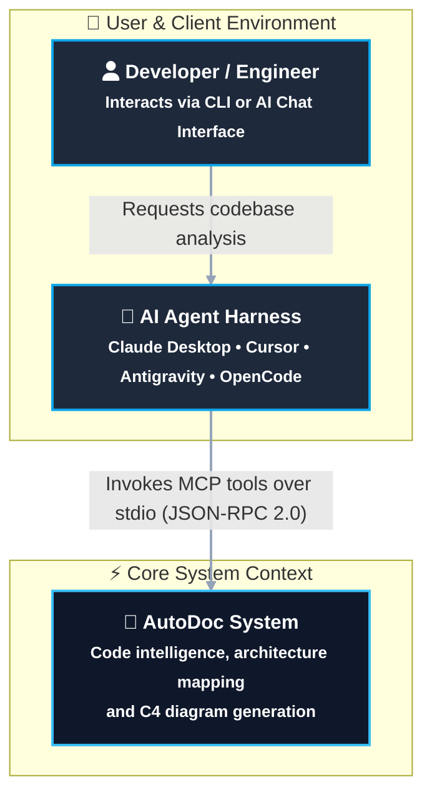
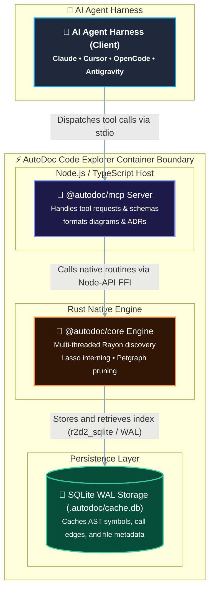
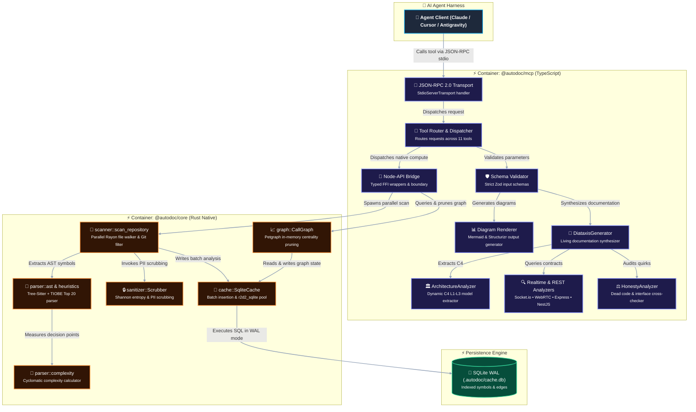
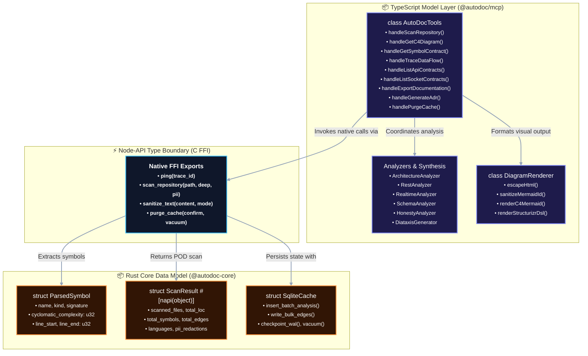

# Reference: AutoDoc Self-Mapping & Codebase Topology

This document presents the self-mapped architectural topology of the AutoDoc repository, computed directly by the AutoDoc MCP Server using its parallel Rayon file discovery engine, SQLite WAL persistence, and C4 visualization pipeline.

---

## Repository Metrics

- **Total Source Files Scanned**: 47 (excluding ignored directories, tests artifacts, and third-party dependencies)
- **Total Lines of Code (LOC)**: ~5,676 LOC
- **Primary Languages**: Rust (`rs`), TypeScript (`ts`)
- **Total AST Symbols Indexed**: 224 symbols
- **Total Call Graph Edges**: 68 edges
- **Engine**: NAPI-RS / Rayon Work-Stealing Multi-Threading & Tree-Sitter Polyglot AST
- **Cache Location**: `.autodoc/cache.db` (SQLite in WAL mode)
- **PII / Secret Scrubbing**: Active (0 credentials or unmasked tokens persisted)

---

## System Context Diagram (Level 1)
 

---

## Container Architecture (Level 2)

---

## Component Architecture (Level 3)

The Component diagram details the internal modular structure of both the TypeScript MCP Server and the Rust Core Engine:

---

## Code Architecture: Core Class & Struct Model (Level 4)

The Code diagram details the key types, structs, interfaces, and data models that govern interaction across the Node-API boundary:

---

## Enterprise API & Realtime Contracts Inventory

AutoDoc natively catalogs contracts across multi-decade and modern realtime protocols:
- **REST**:
  - `POST /api/v1/scan` (Auth: `Bearer`)
  - `POST /api/v1/diagrams/c4` (Auth: `Bearer`)
  - `GET /api/v1/symbols/contract` (Auth: `Bearer`)
  - `POST /api/v1/dataflow/trace` (Auth: `Bearer`)
  - `GET /api/v1/contracts` (Auth: `Bearer`)
  - `GET /api/v1/contracts/sockets` (Auth: `Bearer`)
  - `POST /api/v1/export/docs` (Auth: `Bearer`)
  - `POST /api/v1/adr` (Auth: `Bearer`)
  - `DELETE /api/v1/cache` (Auth: `Bearer`)
- **Realtime (WebSocket & WebRTC)**:
  - `webrtc:offer` (Direction: `BIDIRECTIONAL`, Payload: `RTCSessionDescriptionInit | RTCIceCandidateInit`)
  - `webrtc:answer` (Direction: `BIDIRECTIONAL`, Payload: `RTCSessionDescriptionInit | RTCIceCandidateInit`)
  - `webrtc:candidate` (Direction: `BIDIRECTIONAL`, Payload: `RTCSessionDescriptionInit | RTCIceCandidateInit`)
- **gRPC**:
  - `AutoDocService::Ping` (Auth: `None`, Transport: HTTP/2)
- **Extensible Protocols Supported**:
  - `SOAP 1.1 / 1.2` (WSDL/XSD)
  - `GraphQL` (SDL)
  - `CORBA` (OMG IDL)
  - `WCF` (ServiceContracts)
  - `FlatBuffers` / `Cap'n Proto`
