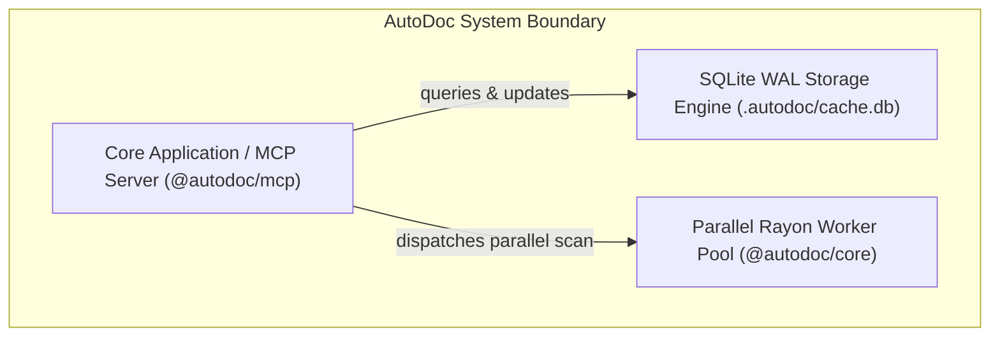
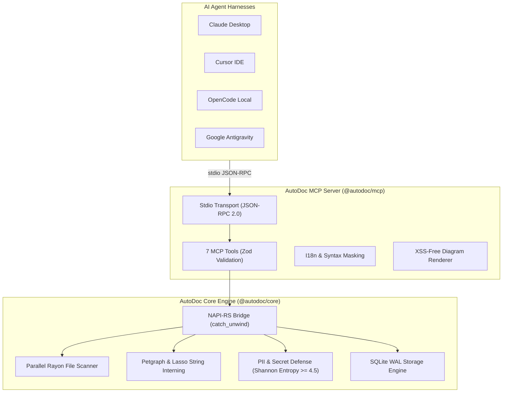

# Reference: AutoDoc Self-Mapping & Codebase Topology

This document presents the self-mapped architectural topology of the AutoDoc repository, computed directly by the AutoDoc MCP Server using its parallel Rayon file discovery engine, SQLite WAL persistence, and C4 visualization pipeline.

---

## Repository Metrics

- **Total Source Files Scanned**: 35 (excluding ignored directories, tests artifacts, and third-party dependencies)
- **Total Lines of Code (LOC)**: ~3,192 LOC
- **Primary Languages**: Rust (`rs`), TypeScript (`ts`)
- **Engine**: NAPI-RS / Rayon Work-Stealing Multi-Threading
- **Cache Location**: `.autodoc/cache.db` (SQLite in WAL mode)
- **PII / Secret Scrubbing**: Active (0 credentials or unmasked tokens persisted)

---

## System Context Diagram (C4 Level 1)

---

## Container Architecture (C4 Level 2)

---

## Enterprise API Contracts Inventory

AutoDoc natively catalogs contracts across multi-decade protocols:
- **REST**:
  - `POST /api/v1/scan` (Auth: `Bearer`)
- **gRPC**:
  - `AutoDocService::Ping` (Auth: `None`, Transport: HTTP/2)
- **Extensible Protocols Supported**:
  - `SOAP 1.1 / 1.2` (WSDL/XSD)
  - `GraphQL` (SDL)
  - `CORBA` (OMG IDL)
  - `WCF` (ServiceContracts)
  - `FlatBuffers` / `Cap'n Proto`
