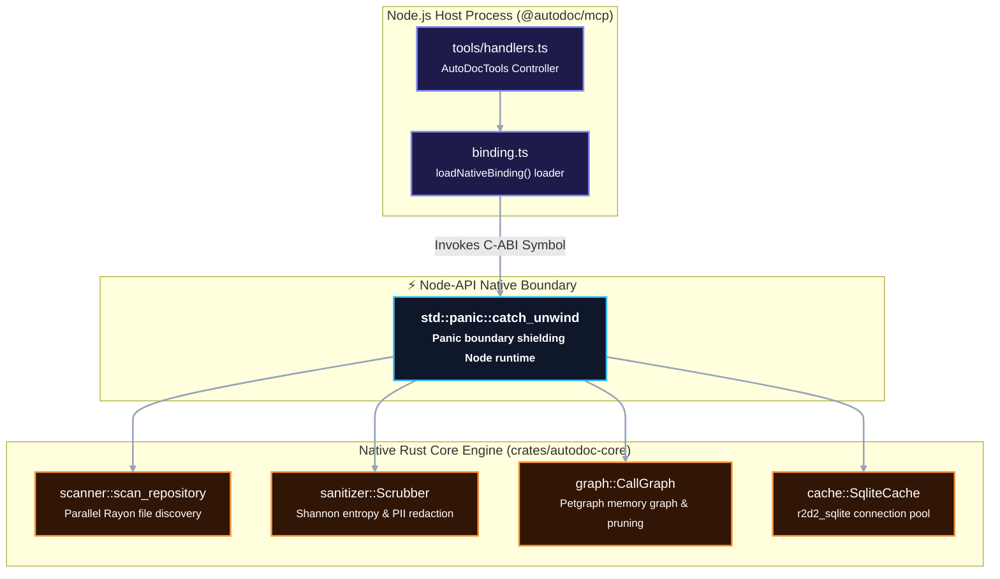

# Reference: Internal APIs & Node-API FFI Specification

This document specifies the internal subsystem APIs and the binary Node-API (NAPI-RS) foreign function interface (FFI) connecting the TypeScript MCP server with the native Rust core.

---

## 1. Node-API Architecture & Memory Safety

The AutoDoc architecture bridges high-level protocol orchestration in Node.js with native systems performance in Rust 2021 via NAPI-RS.



### Memory & Concurrency Invariants
1. **No Shared Mutability Across FFI**: All data crossing the Node-API boundary is transferred either by value through NAPI-RS serialized objects or through compact Plain-Old-Data (POD) structs.
2. **Panic Containment**: Every native export is enclosed in `std::panic::catch_unwind(AssertUnwindSafe(|| { ... }))`. A panic in native code translates to an `AUTODOC_E401` JavaScript error without terminating the Node.js event loop.
3. **Dedicated Global Allocator**: Native code uses `mimalloc` as its global allocator (`#[global_allocator] static GLOBAL: mimalloc::MiMalloc = mimalloc::MiMalloc;`) to maximize multi-threaded allocation throughput.

---

## 2. Native Node-API Exports (`crates/autodoc-core/src/lib.rs`)

### 2.1. `init_logger()`
- **Signature**: `pub fn init_logger()`
- **Description**: Initializes the `tracing_subscriber` diagnostics subsystem. Directs all telemetry and span logs strictly to `std::io::stderr` to preserve stdout stream integrity.
- **Thread Safety**: Idempotent; guarded by atomic initialization.

### 2.2. `ping(trace_id: String) -> Result<PingResponse>`
- **Signature**:
  ```rust
  #[napi]
  pub fn ping(trace_id: String) -> napi::Result<PingResponse>
  ```
- **Description**: Validates FFI communication, measures clock synchronization, and returns build environment metadata.
- **Return Type**:
  ```rust
  #[napi(object)]
  pub struct PingResponse {
      pub trace_id: String,
      pub status: String,
      pub version: String,
      pub rustc_version: String,
      pub timestamp_ms: i64,
  }
  ```

### 2.3. `scan_repository_native(path: String, deep: bool, pii: bool) -> Result<ScanResult>`
- **Signature**:
  ```rust
  #[napi]
  pub fn scan_repository_native(path: String, deep: bool, pii: bool) -> napi::Result<ScanResult>
  ```
- **Description**: Spawns a parallel Rayon traversal on the target directory, applies ignore rules, measures LOC, and records symbol nodes into `.autodoc/cache.db`.
- **Return Type**:
  ```rust
  #[napi(object)]
  pub struct ScanResult {
      pub scanned_files: u32,
      pub total_loc: u32,
      pub languages: Vec<String>,
      pub pii_redactions: u32,
  }
  ```

### 2.4. `sanitize_text_native(content: String, mask_mode: String) -> Result<SanitizeResult>`
- **Signature**:
  ```rust
  #[napi]
  pub fn sanitize_text_native(content: String, mask_mode: String) -> napi::Result<SanitizeResult>
  ```
- **Description**: Scans text for high-entropy secrets ($H \ge 4.5$) and 30+ regex credential patterns, replacing matched spans with token masks (`[REDACTED_SECRET]`).
- **Return Type**:
  ```rust
  #[napi(object)]
  pub struct SanitizeResult {
      pub sanitized_text: String,
      pub redaction_count: u32,
  }
  ```

### 2.5. `calculate_entropy_native(text: String) -> Result<f64>`
- **Signature**:
  ```rust
  #[napi]
  pub fn calculate_entropy_native(text: String) -> napi::Result<f64>
  ```
- **Description**: Calculates the Shannon entropy value $H = -\sum p_i \log_2 p_i$ for the input string to detect raw cryptographic keys and tokens.

### 2.6. `wrap_untrusted_native(raw_code: String, origin: String, path: String, symbol: String) -> Result<String>`
- **Signature**:
  ```rust
  #[napi]
  pub fn wrap_untrusted_native(raw_code: String, origin: String, path: String, symbol: String) -> napi::Result<String>
  ```
- **Description**: Encloses untrusted source code snippets in XML-style boundary tags (`<untrusted_code_context origin="..." path="..." symbol="...">...`) with sanitized interior attributes to prevent prompt injection.

### 2.7. `purge_cache_native(confirm: bool, vacuum: bool) -> Result<bool>`
- **Signature**:
  ```rust
  #[napi]
  pub fn purge_cache_native(confirm: bool, vacuum: bool) -> napi::Result<bool>
  ```
- **Description**: Clears all tables in the SQLite database, triggers a passive WAL checkpoint, and optionally runs `VACUUM`.

### 2.8. `controlled_panic_for_testing()`
- **Signature**:
  ```rust
  #[napi]
  pub fn controlled_panic_for_testing() -> napi::Result<()>
  ```
- **Description**: Triggers a controlled panic to verify that the `catch_unwind` boundary intercepts native failures and converts them into JS exceptions without terminating the host.

---

## 3. Subsystem APIs

### 3.1. SQLite Storage Engine (`crates/autodoc-core/src/cache/`)
Manages durable caching in `.autodoc/cache.db`.

```sql
-- Core Schema DDL
CREATE TABLE IF NOT EXISTS files (
    file_id INTEGER PRIMARY KEY AUTOINCREMENT,
    path TEXT NOT NULL UNIQUE,
    hash TEXT NOT NULL,
    loc INTEGER NOT NULL,
    last_scanned INTEGER NOT NULL
);

CREATE TABLE IF NOT EXISTS symbols (
    symbol_id INTEGER PRIMARY KEY AUTOINCREMENT,
    file_id INTEGER NOT NULL REFERENCES files(file_id) ON DELETE CASCADE,
    fqsn TEXT NOT NULL,
    kind TEXT NOT NULL,
    start_line INTEGER NOT NULL,
    end_line INTEGER NOT NULL
);

CREATE TABLE IF NOT EXISTS edges (
    source_id INTEGER NOT NULL,
    target_id INTEGER NOT NULL,
    weight REAL DEFAULT 1.0,
    PRIMARY KEY (source_id, target_id)
) WITHOUT ROWID;

CREATE INDEX IF NOT EXISTS idx_symbols_fqsn ON symbols(fqsn);
CREATE INDEX IF NOT EXISTS idx_edges_reverse ON edges(target_id, source_id);
```

#### Pragma Settings
```sql
PRAGMA journal_mode = WAL;
PRAGMA synchronous = NORMAL;
PRAGMA busy_timeout = 5000;
PRAGMA cache_size = -64000; -- 64MB cache
PRAGMA foreign_keys = ON;
```

---

### 3.2. In-Memory Call Graph Engine (`crates/autodoc-core/src/graph/`)
Maintains an in-memory directed graph using `petgraph::graph::DiGraph` parameterized over 20-byte POD node structs:

```rust
#[repr(C)]
#[derive(Clone, Copy, Debug)]
pub struct CompactNode {
    pub file_id: u32,
    pub symbol_id: u32,
    pub kind: u8,
    pub flags: u8,
    pub start_line: u32,
    pub end_line: u32,
}
```

- **Centrality Pruning**: Uses PageRank score ranking to prune call graphs down to the top $N$ key nodes (`max_nodes`, default: 35) to prevent context exhaustion in downstream LLM harnesses.

---

### 3.3. Sanitizer & Defensive Security (`crates/autodoc-core/src/sanitizer/`)
- **`PathGuard` (`path_guard.rs`)**: Canonicalizes file paths, neutralizes directory traversal sequences (`../`), and strips home directory roots (`/home/<user>/...` $\to$ `<home>/...`) to protect user privacy.
- **`PromptGuard` (`prompt_guard.rs`)**: Defends against indirect prompt injection by isolating external code inside `<untrusted_code_context>` tags.
- **`Scrubber` (`secret_scanner.rs`)**: Applies high-speed regular expressions (ReDoS-free) and Shannon entropy tests to prevent credentials and PII from being indexed or emitted.
