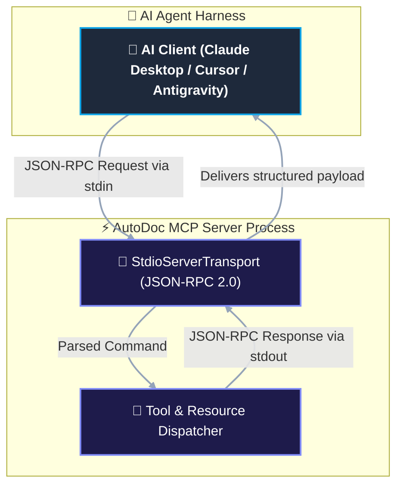

# Reference: Model Context Protocol (MCP) Contracts

This document specifies the formal JSON-RPC 2.0 interface contracts, schemas, parameters, and error states exposed by the AutoDoc MCP Server (`@autodoc/mcp`).

---

## 1. Protocol Architecture & Transports

- **Protocol Version**: Model Context Protocol (MCP) specification 2024-11-05.
- **Transport Mechanism**: Standard Input/Output (`stdio`) using line-delimited JSON-RPC 2.0 payloads.
- **Encoding**: UTF-8.
- **Diagnostic Logging**: Strictly isolated to `stderr` to ensure `stdout` stream purity for JSON-RPC frames.



---

## 2. Registered MCP Tools Catalog

AutoDoc registers nine native tools under the `tools/call` namespace:

```
1. autodoc_scan_repository     -> Multi-threaded file discovery, AST parsing and LOC metrics
2. autodoc_get_c4_diagram       -> Dynamic C4 architectural diagram generation (Levels 1 to 4)
3. autodoc_get_symbol_contract  -> Deterministic AST signature extraction with prompt guard & CC
4. autodoc_trace_data_flow      -> Call graph pathfinding and taint tracing
5. autodoc_list_api_contracts   -> Multi-decade enterprise protocol inventory (REST, SOAP, gRPC)
6. autodoc_list_socket_contracts-> Realtime WebSocket / Socket.io events and WebRTC contracts
7. autodoc_export_documentation -> Living Diátaxis documentation generation and filesystem export
8. autodoc_generate_adr         -> Architectural Decision Record synthesis
9. autodoc_purge_cache          -> GDPR/LGPD compliant cache compaction and vacuum
```

---

## 3. Tool Specifications & Schemas

### 3.1. `autodoc_scan_repository`

Discovers directory structure, programming languages, build manifests, and lines of code (LOC) metrics using a multi-threaded Rayon worker pool and SQLite WAL persistence.

#### Input Schema (`tools/call` parameters)
```json
{
  "type": "object",
  "properties": {
    "repoPath": {
      "type": "string",
      "description": "Absolute or relative path to the repository root directory."
    },
    "repository_path": {
      "type": "string",
      "description": "Alias for repoPath to support heterogeneous agent schemas."
    },
    "deepScan": {
      "type": "boolean",
      "default": false,
      "description": "When true, parses full AST and call graph edges in addition to file metadata."
    },
    "enablePiiScrubbing": {
      "type": "boolean",
      "default": true,
      "description": "When true, scans for secrets and PII, filtering unmasked credentials from cache."
    }
  }
}
```

#### Output Payload
```json
{
  "status": "SUCCESS",
  "repositoryPath": "/home/user/code/my-repo",
  "scannedFiles": 42,
  "totalLoc": 4512,
  "languages": ["rs", "ts"],
  "engine": "NAPI-RS / Rayon",
  "piiScrubbed": true,
  "cacheLocation": ".autodoc/cache.db"
}
```

---

### 3.2. `autodoc_get_c4_diagram`

Renders software architecture diagrams following Simon Brown's C4 model, formatting output in Mermaid.js or Structurizr DSL with OWASP LLM05 output sanitization.

#### Input Schema
```json
{
  "type": "object",
  "properties": {
    "level": {
      "type": "integer",
      "minimum": 1,
      "maximum": 4,
      "default": 2,
      "description": "C4 zoom level: 1 (Context), 2 (Container), 3 (Component), 4 (Code)."
    },
    "max_nodes": {
      "type": "integer",
      "minimum": 10,
      "maximum": 100,
      "default": 35,
      "description": "Centrality-based node pruning ceiling to prevent context exhaustion."
    },
    "format": {
      "type": "string",
      "enum": ["mermaid", "structurizr"],
      "default": "mermaid",
      "description": "Target rendering dialect."
    },
    "locale": {
      "type": "string",
      "default": "en-US",
      "description": "BCP 47 language tag for diagram titles and node roles."
    },
    "sanitizeOutput": {
      "type": "boolean",
      "default": true,
      "description": "Neutralizes HTML tags, script injection vectors, and javascript: URIs."
    }
  }
}
```

#### Output Payload
```json
{
  "content": [
    {
      "type": "text",
      "text": "flowchart TD\n    Dev[\"Developer\"] --> App[\"AutoDoc\"]\n..."
    }
  ]
}
```

---

### 3.3. `autodoc_get_symbol_contract`

Extracts deterministic function and method signatures directly from AST parsing. Output is wrapped in defensive boundaries to counter indirect prompt injection (OWASP LLM01).

#### Input Schema
```json
{
  "type": "object",
  "properties": {
    "symbolName": {
      "type": "string",
      "description": "Fully Qualified Symbol Name (FQSN), e.g. 'Scanner::scan_repository'."
    },
    "symbol_fqsn": {
      "type": "string",
      "description": "Alias for symbolName."
    },
    "filePath": {
      "type": "string",
      "description": "Path to the source file containing the symbol declaration."
    },
    "include_body": {
      "type": "boolean",
      "default": false,
      "description": "When false, elides the implementation body to preserve token budget."
    }
  },
  "required": []
}
```

#### Output Payload
```json
{
  "content": [
    {
      "type": "text",
      "text": "<untrusted_code_context origin=\"ast_scanner\" path=\"crates/autodoc-core/src/scanner.rs\" symbol=\"scan_repository\">pub fn scan_repository(path: &Path, deep: bool) -> Result<ScanSummary, AutoDocError></untrusted_code_context>"
    }
  ]
}
```

---

### 3.4. `autodoc_trace_data_flow`

Traces paths in the dependency and call graphs between an entrypoint and a target sink to identify data flows, security boundaries, and storage operations.

#### Input Schema
```json
{
  "type": "object",
  "properties": {
    "sourceEntrypoint": {
      "type": "string",
      "description": "Source function or entrypoint symbol identifier."
    },
    "entrypoint_symbol": {
      "type": "string",
      "description": "Alias for sourceEntrypoint."
    },
    "targetSink": {
      "type": "string",
      "description": "Target persistence sink, database table, or external API client."
    },
    "maxDepth": {
      "type": "integer",
      "minimum": 1,
      "maximum": 20,
      "default": 5,
      "description": "Maximum depth for breadth-first graph traversal."
    }
  }
}
```

#### Output Payload
```json
{
  "source": "handleScanRepository",
  "sink": "sqlite_edges",
  "path": [
    { "node": "handleScanRepository", "kind": "entrypoint" },
    { "node": "scan_repository_native", "kind": "ffi_bridge" },
    { "node": "cache::SqliteCache::insert_edge", "kind": "sink" }
  ],
  "depth": 3,
  "reachesSink": true
}
```

---

### 3.5. `autodoc_list_api_contracts`

Returns an inventory of exposed and consumed API endpoints across modern and legacy integration protocols.

#### Input Schema
```json
{
  "type": "object",
  "properties": {
    "protocolFilter": {
      "type": "string",
      "description": "Filter by protocol: ALL, REST, SOAP, GRPC, GRAPHQL, CORBA, WCF."
    },
    "protocol_filter": {
      "type": "string",
      "enum": ["ALL", "REST", "SOAP", "GRPC", "GRAPHQL", "CORBA"],
      "description": "Strict enum variant of protocolFilter."
    },
    "limit": {
      "type": "integer",
      "minimum": 1,
      "maximum": 100,
      "default": 50,
      "description": "Pagination batch size."
    },
    "cursor": {
      "type": "string",
      "description": "Pagination cursor for large API inventories."
    }
  }
}
```

#### Output Payload
```json
{
  "protocolsSupported": [
    "REST (OpenAPI 3.0)",
    "gRPC (Protobuf v3)",
    "SOAP (WSDL 1.1/2.0)",
    "GraphQL (SDL)",
    "CORBA (OMG IDL)",
    "WCF (.NET)",
    "FlatBuffers"
  ],
  "endpoints": [
    {
      "protocol": "REST",
      "path": "/api/v1/scan",
      "method": "POST",
      "auth": "Bearer"
    },
    {
      "protocol": "GRPC",
      "path": "AutoDocService/Ping",
      "method": "POST",
      "auth": "None"
    }
  ]
}
```

---

### 3.6. `autodoc_list_socket_contracts`

Discovers Socket.io events, WebSocket listeners and emitters, typed event payloads, and WebRTC signaling contracts across server and client source files.

#### Input Schema
```json
{
  "type": "object",
  "properties": {
    "directionFilter": {
      "type": "string",
      "enum": ["ALL", "CLIENT_TO_SERVER", "SERVER_TO_CLIENT", "BIDIRECTIONAL"],
      "default": "ALL",
      "description": "Filter by event direction."
    },
    "limit": {
      "type": "integer",
      "default": 50,
      "minimum": 1,
      "maximum": 200,
      "description": "Maximum number of events to return."
    },
    "cursor": {
      "type": "string",
      "description": "Pagination cursor."
    }
  }
}
```

#### Output Payload
```json
{
  "protocolsSupported": ["SOCKET_IO", "WEBRTC", "WEBSOCKET"],
  "directionFilter": "ALL",
  "contracts": [
    {
      "eventName": "webrtc:offer",
      "direction": "BIDIRECTIONAL",
      "payloadType": "RTCSessionDescriptionInit | RTCIceCandidateInit",
      "sourceFile": "packages/autodoc-mcp/src/analyzers/realtime/index.ts",
      "protocol": "WEBRTC",
      "isTypedContract": true
    }
  ],
  "total": 1
}
```

---

### 3.7. `autodoc_export_documentation`

Synthesizes living technical documentation structured according to the Diátaxis documentation framework (Tutorials, How-To Guides, Technical Reference, and Architectural Explanation) directly from the SQLite graph and exports it to the filesystem.

#### Input Schema
```json
{
  "type": "object",
  "properties": {
    "outputDir": {
      "type": "string",
      "default": "./docs",
      "description": "Destination directory for generated Diátaxis markdown documents."
    },
    "output_dir": {
      "type": "string",
      "description": "Alias for outputDir."
    },
    "includeSourceRef": {
      "type": "boolean",
      "default": true,
      "description": "Include source code references in generated documents."
    }
  }
}
```

#### Output Payload
```json
{
  "status": "SUCCESS",
  "targetDirectory": "./docs",
  "filesGenerated": 7,
  "files": [
    "architecture/system-overview.md",
    "architecture/quirks-and-dead-code.md",
    "reference/http-endpoints.md",
    "reference/socket-events.md",
    "reference/data-models.md",
    "tutorials/getting-started.md",
    "how-to/add-new-module.md"
  ],
  "message": "Diátaxis living documentation successfully synthesized into ./docs"
}
```

---

### 3.8. `autodoc_generate_adr`

Synthesizes an Architecture Decision Record in Markdown adhering to the MADR standard, translated according to the requested locale.

#### Input Schema
```json
{
  "type": "object",
  "properties": {
    "title": { "type": "string", "description": "Title of the architectural decision." },
    "topic": { "type": "string", "description": "Alias for title." },
    "context": { "type": "string", "description": "Technical drivers, constraints, and problem statement." },
    "decision": { "type": "string", "description": "Accepted architectural decision." },
    "locale": { "type": "string", "default": "en-US", "description": "BCP 47 localization code." }
  },
  "required": ["decision"]
}
```

#### Output Payload
```json
{
  "content": [
    {
      "type": "text",
      "text": "# ADR-20260908-01: Hybrid NAPI-RS Architecture\n\n## Status: Accepted\n..."
    }
  ]
}
```

---

### 3.9. `autodoc_purge_cache`

Executes cache truncation, journal checkpointing, and vacuuming on the local SQLite storage to comply with data privacy policies and GDPR/LGPD regulations.

#### Input Schema
```json
{
  "type": "object",
  "properties": {
    "confirm": {
      "type": "boolean",
      "default": true,
      "description": "Explicit user confirmation to purge the database."
    },
    "vacuum": {
      "type": "boolean",
      "default": true,
      "description": "When true, runs VACUUM to reclaim filesystem disk space."
    }
  }
}
```

#### Output Payload
```json
{
  "status": "purged",
  "vacuumExecuted": true,
  "database": ".autodoc/cache.db",
  "freedBytes": 1048576
}
```

---

## 4. Virtual Resources

AutoDoc exposes static and dynamic MCP resources through `resources/list` and `resources/read`:

| Resource URI | MIME Type | Description |
| :--- | :--- | :--- |
| `code://c4/2` | `text/vnd.mermaid` | Dynamic C4 Container architecture diagram in Mermaid format. |
| `code://graph/callgraph` | `application/json` | Canonical in-memory call graph exported as node-link JSON data. |

---

## 5. Error Codes & Exception Taxonomy

Errors returned by MCP tool execution contain standardized machine-readable error codes:

| Code | Subsystem | Description | Remediation |
| :--- | :--- | :--- | :--- |
| `AUTODOC_E101` | Database | SQLite database connection failed | Verify filesystem permissions on `.autodoc/` directory |
| `AUTODOC_E102` | Database | SQLite busy or lock timeout | Concurrency contention; retry request with backoff |
| `AUTODOC_E201` | Scanner | Repository path unreadable or symlink loop | Check path validity and read permissions |
| `AUTODOC_E301` | Graph | Symbol or edge not found in graph index | Run `autodoc_scan_repository` with `deepScan: true` |
| `AUTODOC_E401` | FFI Boundary | Native Rust panic intercepted safely | Review native panic log on stderr |
| `AUTODOC_E501` | MCP Protocol | Invalid parameters or unhandled tool call | Validate arguments against Zod schema |
